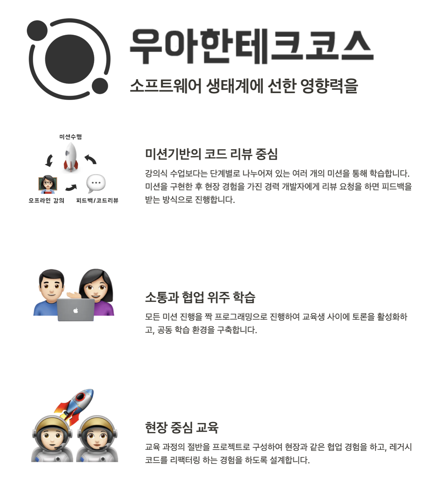
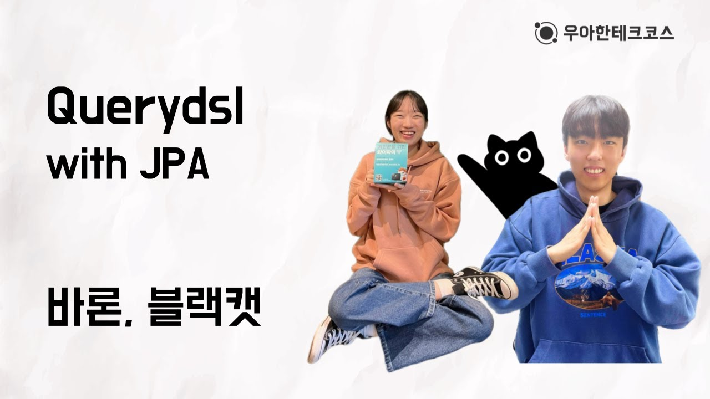

# 👨🏻‍💻 우아한테크코스 5기 백엔드 아카이브

    

> [우아한테크코스](https://www.woowacourse.io/) 5기 백엔드 활동을 정리하는 저장소

## 🎯 Level 1 : 프로그래밍 기본

### 학습 목표
- 자바 프로그래밍 언어에 대한 핵심 개념을 익혀 프로그래밍하는 경험을 한다.
- 읽기 좋은 코드를 구현하는 것이 왜 중요한지와 코드를 개선해 읽기 좋은 코드로 변경해 보는 경험을 한다.
- 자신이 구현한 코드에 대해 단위 테스트와 리팩토링하는 경험을 한다.
- 데이터베이스를 활용한 콘솔 애플리케이션을 개발하는 경험을 한다.

###  학습 키워드
- Java 프로그래밍 기본
- Java Stream API
- TDD, Clean Code, OOP
- 페어 프로그래밍

### 기간
- 2023.02.07 ~ 2023.03.31

### 진행 미션
|  Project  |                                     Repository                                     |                         Pull Request                         |
|:---------:|:----------------------------------------------------------------------------------:| :----------------------------------------------------------: |
| 자동차 경주 게임 |   [java-racingcar](https://github.com/Songusika/java-racingcar/tree/step2/docs)    | [Pull Request](https://github.com/woowacourse/java-racingcar/pulls?q=is%3Apr+%EB%B8%94%EB%9E%99%EC%BA%A3+is%3Aclosed) |
|  사다리 타기   |      [java-ladder](https://github.com/Songusika/java-ladder/tree/step2/docs)       | [Pull Request](https://github.com/woowacourse/java-ladder/pulls?q=is%3Apr+%EB%B8%94%EB%9E%99%EC%BA%A3+is%3Aclosed) |
|    블랙잭    | [java-blackjack](https://github.com/Songusika/java-blackjack/blob/step2/README.md) | [Pull Request](https://github.com/woowacourse/java-blackjack/pulls?q=is%3Apr+%EB%B8%94%EB%9E%99%EC%BA%A3+author%3ASongusika+is%3Aclosed) |
|    체스     |          [java-chess](https://github.com/Songusika/java-chess/blob/step4/README.md)          | [Pull Request](https://github.com/woowacourse/java-chess/pulls?q=is%3Apr+%EB%B8%94%EB%9E%99%EC%BA%A3+is%3Aclosed+author%3ASongusika+review%3Aapproved) |

## 🎯 Level 2 : 스프링 부트 

### 학습 목표
- 스프링 프레임워크를 이용해 웹 애플리케이션을 개발
- 학습 테스트를 통해 새로운 기술을 익히고 미션에 적용
- 클라우드 환경에 애플리케이션을 배포하고 운영
- 새로운 기술을 익히는 본인만의 효과적인 학습 방법 찾기

### 학습 키워드

- Spring boot
- 테스트 - Classist vs Mockist
- RESTful
- CORS
- 인증/인가
- 협업 - 클라이언트
- 인프라

### 기간
- 2023.04.11 ~ 2023.06.09

### 진행 미션
|    Project     |                                        Repository                                        |                         Pull Request                         |
|:--------------:|:----------------------------------------------------------------------------------------:| :----------------------------------------------------------: |
|   자동차 경주 게임    |     [jwp-racingcar](https://github.com/Songusika/jwp-racingcar/blob/step2/README.md)     | [Pull Request](https://github.com/woowacourse/jwp-racingcar/pulls?q=is%3Apr+author%3ASongusika+is%3Aclosed+review%3Aapproved) |
|    쇼핑 장바구니     | [jwp-shopping-cart](https://github.com/Songusika/jwp-shopping-cart/blob/step2/README.md) | [Pull Request](https://github.com/woowacourse/jwp-shopping-cart/pulls?q=is%3Apr+%EB%B8%94%EB%9E%99%EC%BA%A3+is%3Aclosed) |
|     지하철 노선     |   [jwp-subway-path](https://github.com/Songusika/jwp-subway-path/blob/step2/README.md)   | [Pull Request](https://github.com/woowacourse/jwp-subway-path/pulls?q=is%3Apr+%EB%B8%94%EB%9E%99%EC%BA%A3+is%3Aclosed) |
| 쇼핑 장바구니 주문(협업) |    [jwp-shopping-order](https://github.com/Songusika/jwp-shopping-order/blob/step1/README.md)    | [Pull Request](https://github.com/woowacourse/jwp-shopping-order/pull/92) |

## 🎯 Level 3 : 팀 프로젝트

### 학습 목표
- 개발 프로세스 기반으로 프로젝트 진행, 협업하는 경험을 한다.
- 배포를 자동화하고, 피드백을 받아 지속적으로 개선하는 경험을 한다.

### 학습 키워드
- 함께 자라기
- 협업
- Spring Data JPA
- Infra
- CI/CD
- 부하테스트
- 유지보수

### 기간
- 2023.06.27 ~ 2023.8.18

### 디깅룸
- [디깅룸 Github](https://github.com/woowacourse-teams/2023-diggin-room) 
- [디깅룸 Google Play Store](https://play.google.com/store/apps/details?id=com.digginroom.digginroom)
- [디깅룸 홍보 Instagram](https://www.instagram.com/diggin.room/)

### 스프린트
> '룸' 이란 하나의 음악 + 영상을 의미하는 디깅룸의 도메인 용어입니다.😊

| 스프린트  |                           주제                            |                                       데모데이 발표                                       |
|:-----:|:-------------------------------------------------------:|:-----------------------------------------------------------------------------------:| 
| 스프린트1 |              디깅룸 설명, 팀 문화, 사용자 스토리 및 핵심 가치              |   [디깅룸 1차 데모데이](https://www.youtube.com/watch?v=aGBb8JnSe0o)    | 
| 스프린트2 |              개발 환경 구축, 룸 추천 API, 쿠키&세션 인증               | [디깅룸 2차 데모데이](https://www.youtube.com/watch?v=gpnp0TnHRl0)  | 
| 스프린트3 | 프로덕트 환경 구축, CI/CD, 로그 롤링, 비밀번호 암호화, 룸 추천 고도화, 협업 점검, 시연 |  [디깅룸 3차 데모데이](https://www.youtube.com/watch?v=m0Mx6A6yWVU)   | 
| 스프린트4 |                        핵심 기능 소개                         | [디깅룸 4차 데모데이](https://www.youtube.com/watch?v=mZTa11j-m3E) | 

## 🎯 Level 4 : Tomcat & Spring boot 심화 및 리팩터링

### 학습 목표

- 웹 서버를 직접 구현해 HTTP를 이해하고, 서블릿 컨테이너의 동작 원리를 이해한다.
- MVC 프레임워크를 직접 구현해 내부 동작 원리를 이해한다.
- JDBC 라이브러리를 직접 구현해보고 Transaction 동작 원리를 이해한다.
- 레거시 프로젝트를 리팩토링하는 경험을 한다.

### 학습 키워드
- Socket & HTTP 
- Servlet
- Thread & ThreadPool
- MVC 프레임워크
- Reflection
- DispatcherServlet & HandlerMapping & HandlerAdapter
- ArgumentResolver
- Datasource & Connection
- ThreadLocal
- Transaction & ACID
- 유지보수 & 레거시 리팩터링
- 도메인 불변식 보호 & 의존성 분리
- 멀티 모듈

### 기간
- 2023.08.31 ~ 2023.10.20

### 진행 미션
|   Project   |                                            Repository                                            |                         Pull Request                         |
|:-----------:|:------------------------------------------------------------------------------------------------:| :----------------------------------------------------------: |
| Tomcat 구현하기 |    [jwp-dashboard-http](https://github.com/Songusika/jwp-dashboard-http/blob/main/README.md)     | [Pull Request](https://github.com/woowacourse/jwp-dashboard-http/pulls?q=is%3Apr+%EB%B8%94%EB%9E%99%EC%BA%A3+is%3Aclosed+author%3ASongusika) |
|  MVC 구현하기   |          [jwp-dashboard-mvc](https://github.com/Songusika/jwp-dashboard-mvc/tree/step3)          | [Pull Request](https://github.com/woowacourse/jwp-dashboard-mvc/pulls?q=is%3Apr+author%3ASongusika+is%3Aclosed) |
|  JDBC 구현하기  |       [jwp-dashboard-jdbc](https://github.com/Songusika/jwp-dashboard-jdbc)       | [Pull Request](https://github.com/woowacourse/jwp-dashboard-jdbc/pulls?q=is%3Apr+author%3ASongusika+is%3Aclosed) |
| 레거시 코드 리팩터링 |    [jwp-refactoring](https://github.com/Songusika/jwp-refactoring/blob/step4/README.md)    | [Pull Request](https://github.com/woowacourse/jwp-refactoring/pulls?q=is%3Apr+author%3ASongusika+is%3Aclosed) |

## 🖋 Writing
| Level |                 Topic                  |                                            Repository                                             |                   
| :---: | :------------------------------------: |:-------------------------------------------------------------------------------------------------:| 
|   1   |      우아한테크코스 한 달 생활기       |   [woowa-writing-5/level1](https://github.com/Songusika/woowa-writing-5/blob/level4/level1.md)    |
|   2   | 우테코에서 찾은 나만의 효과적인 학습법 |   [woowa-writing-5/level2](https://github.com/Songusika/woowa-writing-5/blob/level4/level2.md)    |
|   4   |      내가 꿈꾸는 프로그래머로서의 삶       |   [woowa-writing-5/level4](https://github.com/Songusika/woowa-writing-5/blob/level4/level4.md)    |

## 📹 Tecotalk
### 발표주제 : _Querydsl with JPA_

    

[Querydsl with JPA](https://youtu.be/Dz-46mPfkGo?si=KEvpZUQeNGhDMSeQ)

